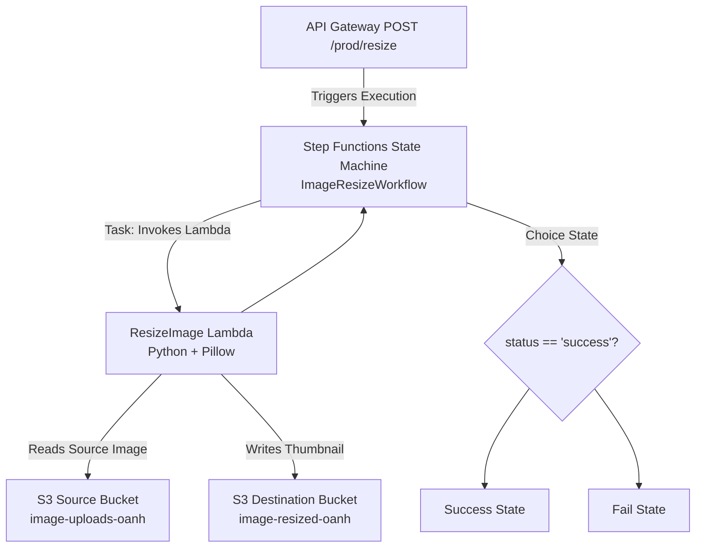

# Serverless Image Processing Pipeline Capstone Project

## Project Objective

The objective of this capstone project is to build a serverless image processing pipeline on AWS.  
This solution automatically resizes images uploaded via an API endpoint, using a choreographed workflow managed by **AWS Step Functions**, **AWS Lambda**, **Amazon S3**, and **Amazon API Gateway**.

---

## High-Level Architecture

The pipeline is triggered externally via an API call, orchestrates a Lambda function for processing, and stores the results back in S3.



---

## Prerequisites

Before deploying or running the application, ensure you have:

- **AWS Account** with permissions for:
  - S3
  - IAM
  - Lambda
  - Step Functions
  - API Gateway
- **Python 3.x** locally (for packaging, if you rebuild the Lambda or layer).
- **Pillow Library** packaged as a **Lambda Layer** (provided here as `pillow311-x86_64.zip`).
- A sample image file, e.g. `test.jpg`, to upload and test the pipeline.

All resources described below are already deployed in my AWS account; the instructions explain how you could recreate them in another account if needed.

---

## Deployed AWS Resources (Current Environment)

These are the actual resource names and ARNs used in my demo video.  
If you redeploy this project in your own AWS account, replace these with your own values.

- **Region:** `ca-central-1` (Canada Central)

- **S3 Buckets**
  - Source (original images): `image-uploads-oanh`
  - Destination (thumbnails): `image-resized-oanh`

- **Lambda Function**
  - Name: `ResizeImage`
  - Runtime: Python 3.x
  - Handler: `resize_function.app.lambda_handler`

- **Step Functions State Machine**
  - Name: `ImageResizeWorkflow`
  - ARN:  
    `arn:aws:states:ca-central-1:897722668847:stateMachine:ImageResizeWorkflow`

- **API Gateway REST API**
  - Name: `ImageResizeAPI`
  - Method & path: `POST /prod/resize`
  - Invoke URL:  
    `https://te3tjmyua1.execute-api.ca-central-1.amazonaws.com/prod/resize`

---

## Project Structure

This repository only contains the pieces you need to deploy the Lambda, the Pillow layer, and the state machine code.

```text
.
├── resize_function/
│   └── app.py                # Lambda handler using Pillow to resize images
├── state_machine.json        # ASL (Amazon States Language) definition for ImageResizeWorkflow
├── pillow311-x86_64.zip      # Pre-built Pillow Lambda Layer package
└── README.md                 # This documentation file
```

### Lambda handler (`resize_function/app.py`)

The handler expects an event shaped like:

```json
{
  "image_key": "test.jpg",
  "source_bucket": "image-uploads-oanh",
  "destination_bucket": "image-resized-oanh"
}
```

The Lambda function:

1. Downloads `image_key` from `source_bucket`.
2. Uses Pillow to generate a resized thumbnail.
3. Uploads the thumbnail to `destination_bucket` with a key such as `thumb-test.jpg`.
4. Returns a result:

```json
{
  "status": "success",
  "thumb_key": "thumb-test.jpg"
}
```

On error, it raises an exception which will cause the Step Functions execution to fail or be routed to the **Fail** state.

### State machine definition (`state_machine.json`)

`state_machine.json` contains the Amazon States Language (ASL) JSON definition for the `ImageResizeWorkflow` state machine.  
It defines:

1. A **Task** state that invokes the `ResizeImage` Lambda function and waits for the response.
2. A **Choice** state that checks whether `$.status == "success"`.
3. A **Success** state (terminal) and a **Fail** state (terminal).


---

## Deployment Instructions 

These steps describe how to recreate the solution from scratch and run the serverless pipeline.

### Step 1: Create S3 Buckets

1. Open the **S3** console.
2. Create two buckets:
   - **Source bucket** for original images  
     e.g. `my-original-images-bucket`
   - **Destination bucket** for resized images  
     e.g. `my-resized-images-bucket`
3. Record the bucket names; you will pass them to the Lambda function in the event.

---

### Step 2: Deploy the Pillow Lambda Layer

If you don’t already have a pre-built layer:

1. In a Linux environment compatible with Lambda (or Docker), run:
  *Note: This step must be performed in a Linux environment compatible with AWS Lambda
   ```bash
   mkdir -p python
   pip install Pillow -t python/
   zip -r pillow-layer.zip python/
   ```

2. In the **Lambda → Layers** console:
   - Click **Create layer**.
   - Name it (e.g.) `PillowLayer`.
   - Upload `pillow-layer.zip` (or `pillow311-x86_64.zip` from this repo).
   - Select the appropriate Python runtime (e.g. Python 3.11).
   - Create the layer and record its ARN.

In my project, this layer is provided as `pillow311-x86_64.zip`.

---

### Step 3: Deploy the Lambda Function

1. Go to **Lambda → Create function**.
2. Choose **Author from scratch**:
   - Function name: `ResizeImage`
   - Runtime: Python 3.x
3. Create or select an execution role that:
   - Has basic Lambda execution permissions (CloudWatch Logs).
   - Has S3 read/write access to both the source and destination buckets.
4. On the function page:
   - Use the code from the file `image_resizer.py` of `resize_function/` folder for Lambda's function code

5. Under **Layers**:
   - Click **Add a layer**.
   - Choose your Pillow layer (e.g. `Pillow311Layer`).
   - Save.

6. (Optional) Test the function directly with a sample event:

   ```json
   {
     "image_key": "test.jpg",
     "source_bucket": "my-original-images-bucket",
     "destination_bucket": "my-resized-images-bucket"
   }
   ```

Ensure it returns `status: "success"` and writes a `thumb-test.jpg` file into the destination bucket.

---

### Step 4: Deploy the Step Functions State Machine

1. Go to **Step Functions → Create state machine**.
2. Choose **Standard** type.
3. Select **Author with code snippets** and paste the contents of `state_machine.json` into the definition editor.
4. Configure the **Task** state in the JSON so that the `Resource` ARN points to your `ResizeImage` Lambda.
5. Set the state machine’s execution role to allow `lambda:InvokeFunction` on the `ResizeImage` Lambda.
6. Create the state machine and note its ARN. You will need this ARN for API Gateway.

---

### Step 5: Deploy the API Gateway Endpoint

1. Go to **API Gateway → REST API → Build**.
2. Create a new REST API (Regional), named `ImageResizeAPI`.
3. Under **Resources**:
   - Create a resource `/resize`.
   - Add a `POST` method on `/resize`.
4. Configure the `POST` method:
   - Integration type: **AWS Service**.
   - AWS Service: **Step Functions**.
   - HTTP method: `POST`.
   - Action: `StartExecution`.
   - Execution role: IAM role with `states:StartExecution` on your state machine.
5. In **Integration Request → Mapping templates**:
   - Add a mapping template for `application/json` with:

     ```vtl
     {
       "stateMachineArn": "STATE_MACHINE_ARN",
       "name": "$context.requestId",
       "input": "$util.escapeJavaScript($input.body)"
     }
     ```

   - Replace `STATE_MACHINE_ARN` with your actual state machine ARN.
6. **Deploy** the API to a stage (e.g. `prod`).
7. Record the full invoke URL, e.g.:

   ```text
   https://<api-id>.execute-api.<region>.amazonaws.com/prod/resize
   ```

---

## Usage Demo

### Final API Gateway URL (My Deployment)

**Method:** `POST`  
**URL:**

```text
https://te3tjmyua1.execute-api.ca-central-1.amazonaws.com/prod/resize
```

### Test Procedure

1. **Upload a test image** to the source bucket:

   - Open the **S3** console.
   - Go to `image-uploads-oanh`.
   - Upload a file, e.g. `test.jpg`.

2. **Trigger the pipeline via API (Postman, curl, or API Gateway Test):**

   Example JSON payload:

   ```json
   {
     "image_key": "test.jpg",
     "source_bucket": "image-uploads-oanh",
     "destination_bucket": "image-resized-oanh"
   }
   ```

   Using `curl`:

   ```bash
   curl -X POST      'https://te3tjmyua1.execute-api.ca-central-1.amazonaws.com/prod/resize'      -H 'Content-Type: application/json'      -d '{
           "image_key": "test.jpg",
           "source_bucket": "image-uploads-oanh",
           "destination_bucket": "image-resized-oanh"
         }'
   ```

3. **Verify API Response:**
   - You should receive a `200 OK`.
   - The response body contains the ARN of the Step Functions execution:

     ```json
     {
       "executionArn": "arn:aws:states:ca-central-1:897722668847:execution:ImageResizeWorkflow:...",
       "startDate": 1.763436708869E9
     }
     ```

---

## Verification

1. **Step Functions Console**
   - Navigate to `ImageResizeWorkflow`.
   - Confirm that a new execution exists and has **Succeeded**.
   - In the execution graph, verify the flow:
     - `ResizeImage` → `CheckResult` → `Success`.

2. **Lambda Output**
   - In the execution’s **Input and output** tab, confirm the Lambda result includes:

     ```json
     {
       "status": "success",
       "thumb_key": "thumb-test.jpg"
     }
     ```

3. **S3 Console**
   - Open the destination bucket `image-resized-oanh`.
   - Confirm that a new file like `thumb-test.jpg` has been created.
   - Download and open it to verify it is a resized version of the original image.

---

## Source Code

| File Name | Description |
| :--- | :--- |
| `resize_function/image_resizer.py` | Python code for the Lambda function. |
| `state_machine.json` | Definition of the Step Functions workflow using Amazon States Language (ASL). |
| `.gitignore` | Standard file to exclude temporary directories and files. |
| `LICENSE` | Licensing information for the project code. |

---


